# FastDiscordDB Project

## Overview
FastDiscordDB is a FastAPI-powered application designed to handle the storage and retrieval of Discord chat exports into a PostgreSQL database and Elasticsearch. This project utilizes DiscordChatExporter to fetch chats and provides API endpoints for querying these chats by keyword or date range.

## Features

### Discord Chat Exports
- **Functionality**: Automatically downloads and stores chats from the last 7 days from a specified Discord channel into a PostgreSQL database using given user credentials.
- **Integration**: Utilizes [DiscordChatExporter](https://github.com/Tyrrrz/DiscordChatExporter) to fetch chat data in JSON format and stores it as structured data in PostgreSQL.

### Search by Keyword API
- **Endpoint**: `/api/search/keyword`
- **Method**: `GET`
- **Description**: Searches the database for chat messages containing the specified keyword.

### Search by Date API
- **Endpoint**: `/api/search/date`
- **Method**: `GET`
- **Description**: Retrieves chat messages within a specified date range from the database.


## Project Structure
```
/FastDiscordDB
│
├── app                     # Main application package
│   ├── __init__.py         # Initializes the Python package
│   ├── main.py             # Entry point to the FastAPI app, contains app configurations
│   ├── dependencies.py     # Dependency injection for database sessions and configurations
│   ├── models.py           # SQLAlchemy ORM models for your database schema
│   ├── schemas.py          # Pydantic models for data validation and serialization
│   ├── crud.py             # CRUD operations (database interaction logic)
│   ├── services            # Business logic and service layer
│   │   ├── __init__.py
│   │   ├── chat_exporter.py # Handles the logic for exporting chats using DiscordChatExporter
│   │   ├── chat_queries.py  # Business logic for querying chat data
│   │   ├── elasticsearch_chat_exporter.py # Handles the logic for exporting chats to Elasticsearch using DiscordChatExporter
│   │   └── elasticsearch_chat_queries.py  # Business logic for querying chat data from Elasticsearch

│   ├── api                 # API endpoints organized by functionality
│   │   ├── __init__.py
│   │   ├── chat.py         # Endpoints for chat operations and dynamic channel handling
│   │   └── search.py       # Endpoints for searching chats by keyword and date
│   └── core                # Core application components
│       ├── config.py       # Configuration settings (e.g., database URL, API keys)
│       └── database.py     # Database connection setup
│
├── tests                   # Test modules
│   ├── __init__.py
│   └── test_api            # Tests for API endpoints
│       ├── __init__.py
│       ├── test_chat.py    # Tests for chat export and dynamic channel functionality
│       └── test_search.py  # Tests for search functionality
│
│
├── venv                    # Virtual environment directory (not committed to version control)
│
├── requirements.txt        # Project dependencies
├── .gitignore              # Specifies intentionally untracked files to ignore
└── README.md               # Project overview and setup instructions
```

## System Architecture
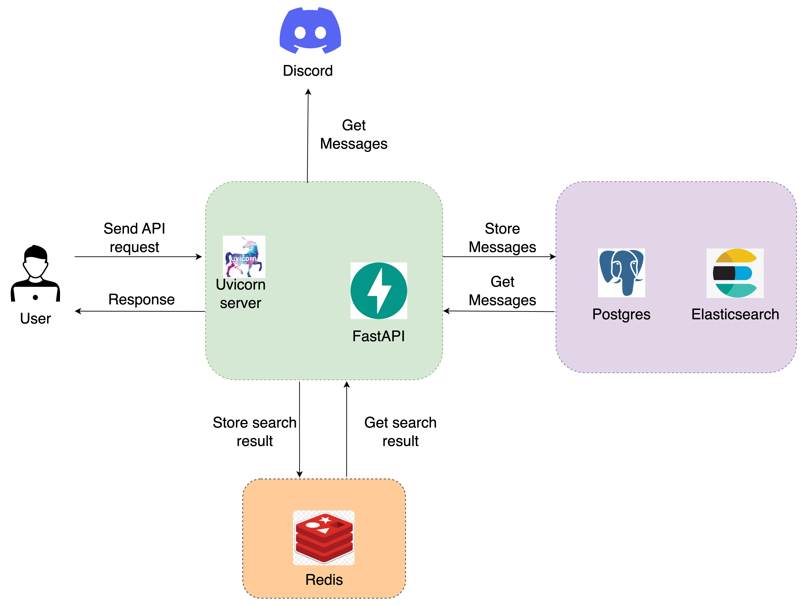

## Core Functionalities

### Chat Export Workflow


### Search by Keyword and Date Range Workflow

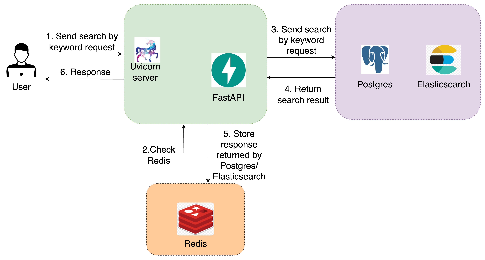


## System Design and Optimizations

### Architecture
FastDiscordDB utilizes a sophisticated system architecture combining several key technologies to ensure efficient data handling and retrieval:
- **FastAPI**: Serves as the backbone of the web server, providing high performance and easy asynchronous support.
- **Redis**: Used as a caching layer to decrease load times and reduce database queries for frequently accessed data.
- **PostgreSQL**: Acts as the primary data store, optimized with indexes for efficient data retrieval.
- **Elasticsearch**: Integrated to enhance search capabilities, allowing for rapid, full-text search functionalities across massive datasets.

### Asynchronous Programming Benefits
Asynchronous programming is crucial for improving performance and scalability:
- **Improved Performance**: Non-blocking calls allow better utilization of system resources, enabling multiple operations concurrently without waiting for each task to complete.
- **Efficient Database Interactions**: Asynchronous database sessions manage transactions more efficiently, crucial for operations like large batch inserts or updates.
- **Scalability**: Handles a larger number of requests with the same hardware resources, providing consistent performance under varying loads.
- **Developer Productivity and Error Handling**: Simplifies coding asynchronous operations, improving readability and maintainability while providing structured error handling.

### Technology Stack and Implementation Details
- **SQLAlchemy**: Provides an efficient ORM system for database operations, making data model representation intuitive and secure, and supporting multiple database backends.
- **Pydantic**: Ensures that data sent and received is correct through robust validation mechanisms, enhancing performance with Python type hints.
- **Bulk Uploads**: Both PostgreSQL and Elasticsearch are optimized with bulk operations to enhance efficiency and reduce overhead, crucial for managing large datasets.

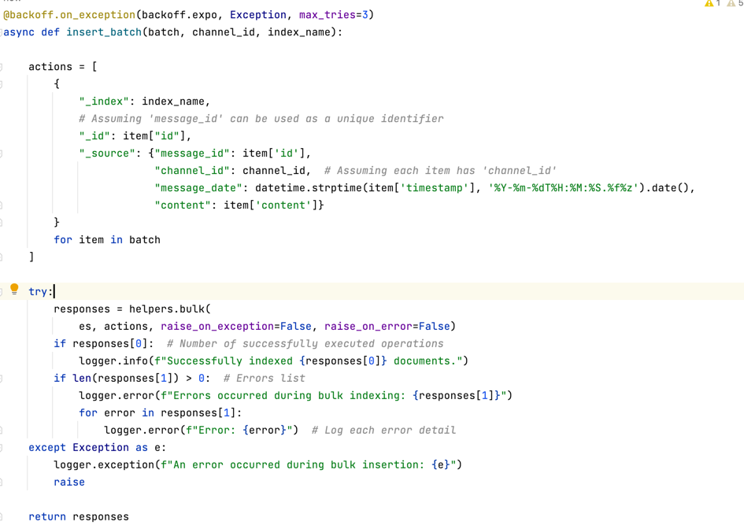

### Optimizations
- **Message and SQL Indexing**: Messages in PostgreSQL are indexed to speed up queries, and strategic indexing is used for optimizing complex query operations.
- **Full-Text Search with `tsvector`**: Enhances PostgreSQL's search capabilities, using `tsvector` for efficient indexing and `plainto_tsquery` for simplifying search strings into a tsquery object.
- **Text Search Efficiency with `pg_trgm`**: The `ilike` operator, supported by `pg_trgm` GIN indexing, allows for efficient, case-insensitive text searches.

tsvector is a data type in PostgreSQL used for full-text searching. It represents a document in a compressed and preprocessed format optimized for text search. Here’s how it works in short:

- Tokenization: The input text is split into tokens. Each token represents a word.
- Normalization: Tokens are normalized to reduce them to a consistent form. This might involve lowercasing, stemming (reducing words to their base form), and removing stop words.
- Vectorization: The normalized tokens are stored in a tsvector, along with optional position information for each token. This format is optimized for quick searches.

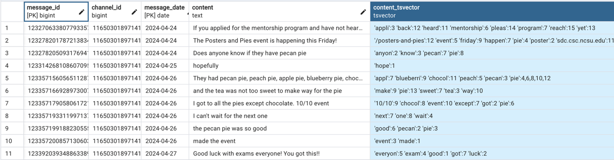
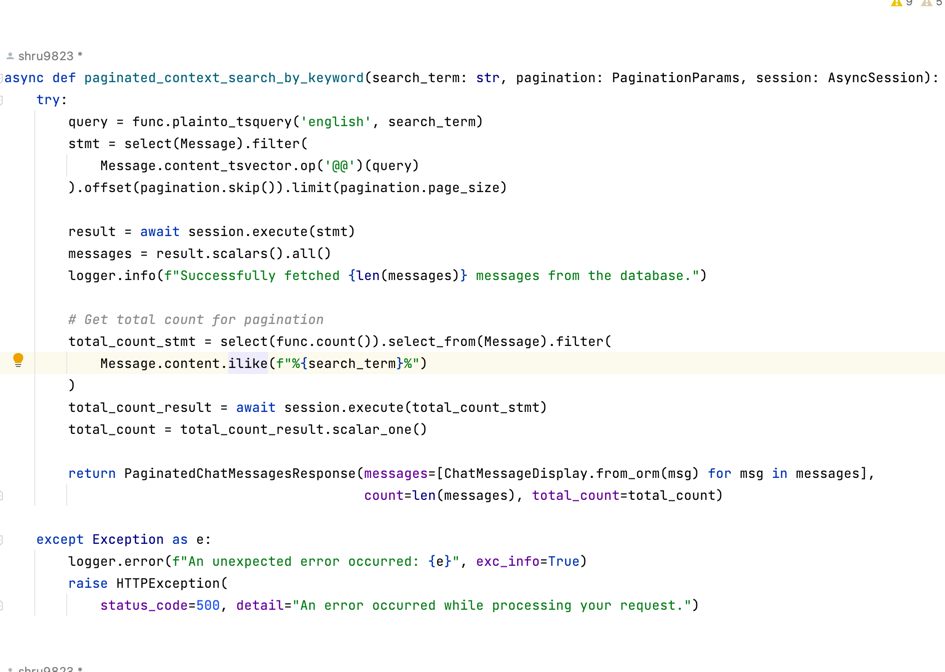


### Database Optimization with Partitioning
Partitioning by range on `message_date` in PostgreSQL allows the database engine to quickly locate and retrieve data from specific partitions, improving query performance and facilitating easier data management.
```commandline
CREATE INDEX idx_message_date ON discord_chats(message_date);

CREATE TABLE discord_chats_2024_04 PARTITION OF discord_chats FOR VALUES FROM ('2022-04-01') TO ('2022-04-30');

```

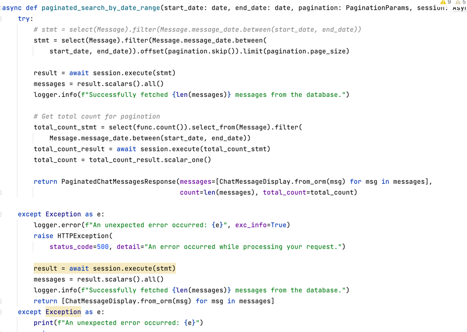

### Utilizing Redis for Enhanced Search Capabilities
Redis is the fastest in memory database.
Redis serves as a rapid-access cache layer:
- **Speed**: Offers sub-millisecond response times for cached data, crucial for frequently made search queries.
- **Reduced Load on Primary Database**: By caching results, Redis minimizes direct database queries, alleviating load during peak times.
- **Scalability**: Supports horizontal scaling with data eviction policies to manage memory efficiently.

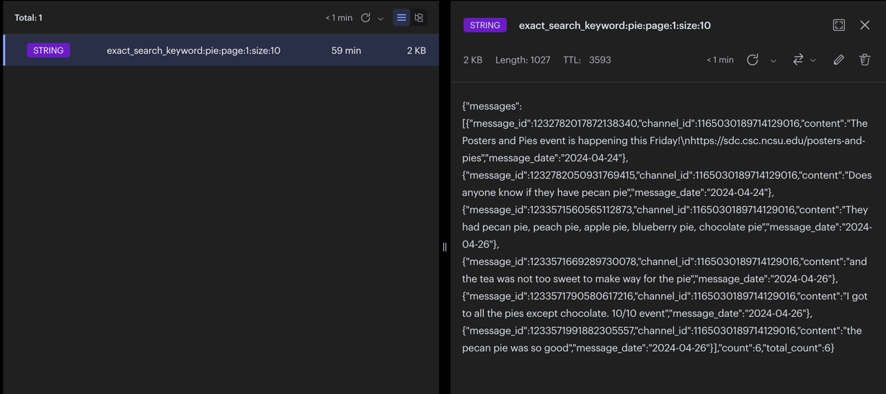

### Elasticsearch Versus PostgreSQL for Full-Text Search
Elastic search is a distributed, restful search and analytics engine.
Elasticsearch performs full-text searches through a combination of indexing and the use of powerful query DSL (Domain Specific Language).
It performs tokenization and other steps like removing stop words, applying stemmers and then the tokens are indexed in a data structure called an inverted index, which helps in search operation.
Elasticsearch provides superior full-text search functionalities:
- **Designed for Search Operations**: Optimized for fast searching with a distributed nature for easy scalability.
- **Complex Query Language**: Supports extensive, complex search queries including fuzzy searching and boolean logic.
- **Real-Time Search and Analytics**: Near real-time search capabilities and powerful aggregation features enhance data analysis potential.

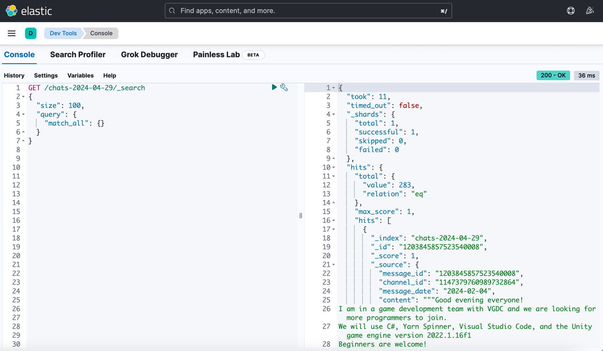

### Implementing Pagination in Search APIs
Pagination is implemented across all search APIs to improve user experience and reduce server load:
- **User Experience**: Allows easy navigation through manageable chunks of data.
- **Performance**: Enhances response times and conserves bandwidth by loading fewer items at a time.
- **Resource Control**: Manages network traffic and resource allocation effectively, especially in cloud environments.

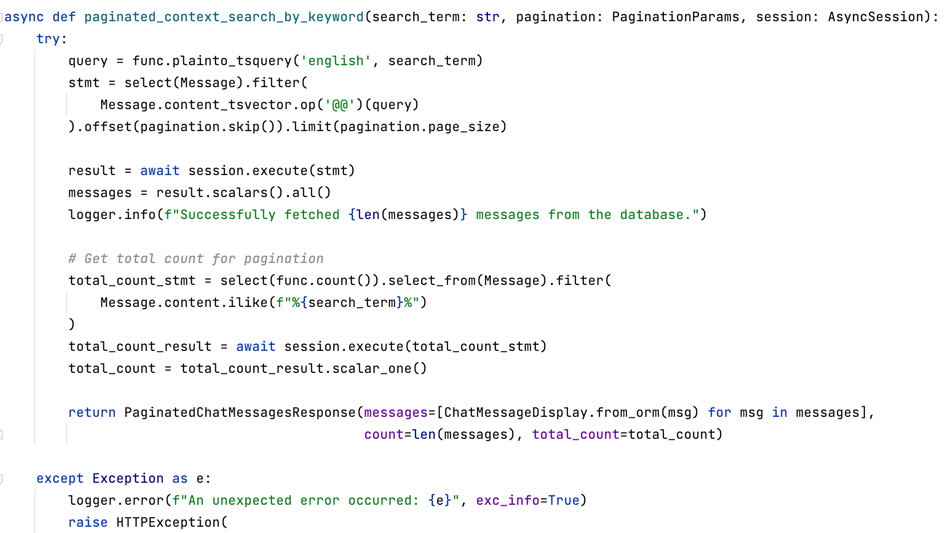


### Conclusion
The integration of these technologies and methodologies ensures that FastDiscordDB can efficiently handle large volumes of data, maintain high availability, and deliver quick API responses. This design is tailored for environments where data integrity, speed, and reliability are paramount.

## Getting the Most Out of FastDiscordDB
- **Optimize Configuration**: Regularly update Elasticsearch indices and monitor Redis cache hit rates to adjust settings as needed.
- **Database Index Management**: Continuously optimize database indices based on observed query patterns.

## Scalability
FastDiscordDB’s architecture supports vertical and horizontal scaling to accommodate increasing loads, ensuring the system's adaptability and sustainability as demands grow.


## Installation
```bash
# Clone the repository
git clone https://github.com/shru9823/FastDiscordDB.git
cd FastDiscordDB

# Setup virtual environment
python -m venv venv
source venv/bin/activate

# Install dependencies
pip install -r requirements.txt
```

## To start the application
```bash
uvicorn app.main:app --reload
```

## Postgres Database setup
```bash
CREATE TABLE discord_chats (
    message_id BIGINT,
    channel_id BIGINT,
    message_date DATE,
    content TEXT,
    PRIMARY KEY (message_id, message_date)
) PARTITION BY RANGE (message_date);


ALTER TABLE discord_chats
ADD COLUMN content_tsvector TSVECTOR;


UPDATE discord_chats
SET content_tsvector = to_tsvector('english', content);

CREATE INDEX idx_content_tsvector ON discord_chats USING gin(content_tsvector);

CREATE INDEX idx_message_date ON discord_chats(message_date);

CREATE extension pg_trgm;

CREATE INDEX discord_chats_trgm_gin ON discord_chats USING gin (content gin_trgm_ops);

CREATE TABLE discord_chats_2024_04 PARTITION OF discord_chats FOR VALUES FROM ('2022-04-01') TO ('2022-04-30');
```

## API Documentation

### 1. Export Chat to PostgreSQL

This endpoint exports chat data from a specified Discord channel to a PostgreSQL database.

#### HTTP Method
`POST`

#### URL
`/api/chats/export/{channel_id}`

#### URL Parameters
- **channel_id**: The unique identifier for the Discord channel. This parameter is required and must be specified in the URL.

#### Headers
- **X-Token**: A Discord authentication token required to access the channel. This should be included in the headers as `X-Token`. If this header is missing, the API will return a 400 error indicating the Discord token is missing.

#### Request
No request body is needed for this API call. The required data is provided via URL parameters and headers.

#### Response
The response will be in JSON format with the following keys:
- **status**: The status of the operation (`success` or `error`).
- **data**: The data returned from the Discord chat export operation.
- **process_time**: The time taken to process the chat export, in seconds.

#### Success Response Example
```json
{
  "status": "success",
  "data": {
      "message": "Successfully inserted 11 messages into the database."
  },
  "process_time": "2.8182 seconds"
}
```

#### Error Response Example
Missing Discord Token - Status Code: 400 Bad Request
```{
  "detail": "Missing Discord token."
}
```

Internal Server Error - Status Code: 500 Internal Server Error
```{
  "detail": "An error occurred while processing your request."
}
```


### 2.  Export Chat to Elasticsearch

This endpoint facilitates the exportation of chat data from a specified Discord channel to an Elasticsearch index.

#### HTTP Method
`POST`

#### URL
`/api/es/chats/export/{channel_id}`

#### URL Parameters
- **channel_id**: The unique identifier for the Discord channel from which chat data will be exported. This parameter is required and must be specified in the URL.

#### Headers
- **X-Token**: A required Discord authentication token to access the channel's data. It should be included in the headers as `X-Token`. Omitting this token will result in a 400 error, indicating the absence of the required Discord token.

#### Request
This API does not require a body for the request. All necessary data is provided through URL parameters and headers.

#### Response
The API response is structured in JSON format, providing details about the operation status, data retrieved, and the time taken to process the request.

#### Success Response Example
```json
{
  "status": "success",
  "data": {
      "message": "Successfully inserted 11 messages into the database."
  },
  "process_time": "2.5471 seconds"
}
```

#### Error Response Example
Missing Discord Token - Status Code: 400 Bad Request
```{
  "detail": "Missing Discord token."
}
```

Internal Server Error - Status Code: 500 Internal Server Error
```{
  "detail": "An error occurred while processing your request."
}
```


### 3.  Search Chat Messages by Keyword

This endpoint allows for the exact searching of chat messages by keyword, returning paginated results. It integrates caching to enhance performance by reducing database load for frequently made queries.

#### HTTP Method
`GET`

#### URL
`/api/chats/search`

#### Query Parameters
- **search_term**: A keyword string used for searching within chat messages. This parameter is mandatory and must be between 1 and 100 characters in length.
- **page**: The page number in the pagination sequence.
- **page_size**: The number of chat messages to return per page.

#### Headers
No specific headers required for this request.

#### Request
Include the `search_term`, `page`, and `page_size` in the query string of your request URL.

#### Response Model
The response will be structured as a JSON object that follows the `PaginatedChatMessagesResponse` model, including fields for the total number of messages, the current page, total pages, and the list of messages.

#### Success Response Example
For a page 1 and page_size 10, the response is given below for a search_term - "pie"
```json
{
  "messages": [
    {
      "message_id": 1232782017872138200,
      "channel_id": 1165030189714129000,
      "content": "The Posters and Pies event is happening this Friday!\nhttps://sdc.csc.ncsu.edu/posters-and-pies",
      "message_date": "2024-04-24"
    },
    {
      "message_id": 1232782050931769300,
      "channel_id": 1165030189714129000,
      "content": "Does anyone know if they have pecan pie",
      "message_date": "2024-04-24"
    },
    {
      "message_id": 1233571560565112800,
      "channel_id": 1165030189714129000,
      "content": "They had pecan pie, peach pie, apple pie, blueberry pie, chocolate pie",
      "message_date": "2024-04-26"
    },
    {
      "message_id": 1233571669289730000,
      "channel_id": 1165030189714129000,
      "content": "and the tea was not too sweet to make way for the pie",
      "message_date": "2024-04-26"
    },
    {
      "message_id": 1233571790580617200,
      "channel_id": 1165030189714129000,
      "content": "I got to all the pies except chocolate. 10/10 event",
      "message_date": "2024-04-26"
    },
    {
      "message_id": 1233571991882305500,
      "channel_id": 1165030189714129000,
      "content": "the pecan pie was so good",
      "message_date": "2024-04-26"
    }
  ],
  "count": 6,
  "total_count": 6
}
```

#### Error Response Example
Keyword Missing - Status Code: 400 Bad Request
```{
  "detail": "Keyword must not be empty"
}
```

Internal Server Error - Status Code: 500 Internal Server Error
```{
  "detail": "An internal error occurred"
}
```

No Messages Found - Status Code: 200 OK
```{
  "detail": "No messages found"
}
```


### 4.  Search All Chat Messages by Keyword

This endpoint performs an exact keyword search across all chat messages, retrieving data without pagination either from the cache or the database, depending on availability and cache validity.

#### HTTP Method
`GET`

#### URL
`/api/chats/search/all`

#### Query Parameters
- **search_term**: A keyword string used for searching within all chat messages. This parameter is required and must be between 1 and 100 characters in length.

#### Headers
No specific headers are required for this request.

#### Request
Include the `search_term` in the query string of your request URL.

#### Response Model
The response is structured as a JSON object following the `ChatMessagesResponse` model, which includes fields for the count of messages and a list of the messages themselves.

#### Success Response Example
```json
{
  "messages": [
    {
      "message_id": 1233920393488633900,
      "channel_id": 1165030189714129000,
      "content": "Good luck with exams everyone! You got this!!",
      "message_date": "2024-04-27"
    }
  ],
  "count": 1
}
```

#### Error Response Example
Keyword Missing - Status Code: 400 Bad Request
```{
  "detail": "Keyword must not be empty"
}
```

Internal Server Error - Status Code: 500 Internal Server Error
```{
  "detail": "An internal error occurred"
}
```

No Messages Found - Status Code: 200 OK
```{
  "detail": "No messages found"
}
```
### 5. Contextual Chat Message Search API

This API endpoint allows for contextual searches within chat messages using a specific keyword. It supports pagination and utilizes caching for optimized performance. Search results are first attempted to be retrieved from the cache; if not available, the database is queried directly.

#### HTTP Method
`GET`

#### Endpoint URL
`/api/chats/context-search`

#### Query Parameters
- **search_term** (required): A keyword string used for searching within chat messages. The string must be between 1 and 100 characters in length.

#### Dependencies
- **PaginationParams**: Pagination control parameters (page number and page size), injected as a dependency.
- **db**: An instance of `AsyncSession` for handling database operations, injected as a dependency.

#### Headers
No specific headers are required for this request.

#### Request Example
Include the `search_term` in the query string of your request URL along with pagination parameters like `page` and `size`. Here's an example:

`GET /api/chats/context-search?search_term=example&page=1&size=10`

#### Responses

##### Success Response
```json
{
  "messages": [
    {
      "message_id": "1234567890",
      "channel_id": "0987654321",
      "content": "How do we handle client requirements?",
      "message_date": "2024-04-29"
    }
  ],
  "count": 1
}
```
#### Error Response Example
Keyword Missing - Status Code: 400 Bad Request
```{
  "detail": "Keyword must not be empty"
}
```

Internal Server Error - Status Code: 500 Internal Server Error
```{
  "detail": "An internal error occurred"
}
```

No Messages Found - Status Code: 200 OK
```{
  "detail": "No messages found"
}
```

### 6.  Search Chat Messages by Date Range

This endpoint allows for searching chat messages within a specified date range, returning paginated results. The results are cached to enhance performance and reduce database load for frequent queries.

#### HTTP Method
`GET`

#### URL
`/api/chats/search/by-date`

#### Query Parameters
- **start_date**: The start date for the date range filter. The date format should be `YYYY-MM-DD`.
- **end_date**: The end date for the date range filter. The date format should be `YYYY-MM-DD`.
- **page**(Optional): The page number in the pagination sequence.
- **page_size**(Optional): The number of chat messages to return per page.

#### Headers
No specific headers are required for this request.

#### Request
Include `start_date`, `end_date`, `page`, and `page_size` in the query string of your request URL.

#### Response Model
The response will be structured as a JSON object that follows the `PaginatedChatMessagesResponse` model, including fields for the total number of messages, the current page, total pages, and the list of messages.

#### Success Response Example
```json
{
  "messages": [
    {
      "message_id": 0,
      "channel_id": 0,
      "content": "string",
      "message_date": "2024-05-01"
    }
  ],
  "count": 0,
  "total_count": 0
}
```

#### Error Response Example

Internal Server Error - Status Code: 500 Internal Server Error
```{
  "detail": "An internal error occurred"
}
```

No Messages Found - Status Code: 200 OK
```{
  "detail": "No messages found"
}
```

# 7.  Elasticsearch Chat Message Search API

## Overview
This API endpoint facilitates keyword-based search across chat messages stored in Elasticsearch, with pagination support. It enhances performance by leveraging caching via Redis. If cached results are available and valid, they are returned; otherwise, Elasticsearch is queried directly.

## API Endpoint Details

### HTTP Method
`GET`

### Endpoint URL
`/api/es/chats/search`

### Query Parameters
- **keyword** (required): The search keyword used to find relevant chat messages. This is mandatory for the search operation.

### Dependencies
- **PaginationParams**: Controls the pagination aspects (such as page number and size), injected as a dependency.

### Headers
No specific headers are required for this request.

### Request Example
Include the `keyword` in the query string of your request URL along with pagination parameters. Here's how you might structure the request:

`GET /api/es/chats/search?keyword=update&page=1&size=10`


### Responses

#### Success Response
A successful response returns a list of messages that match the keyword, along with pagination details:

```json
{
  "messages": [
    {
      "message_id": 0,
      "channel_id": 0,
      "content": "string",
      "message_date": "2024-05-01"
    }
  ],
  "count": 0,
  "total_count": 0
}
```
#### Error Response Example
Keyword Missing - Status Code: 400 Bad Request
```{
  "detail": "Keyword must not be empty"
}
```

Internal Server Error - Status Code: 500 Internal Server Error
```{
  "detail": "An internal error occurred"
}
```

No Messages Found - Status Code: 404 Not Found
```{
  "detail": "No messages found"
}
```

### 8. Elasticsearch Chat Message Search by Date API

This API endpoint enables users to search for chat messages within a specific date range using Elasticsearch. It includes pagination and caching mechanisms to improve response times and reduce load on the backend systems.

#### HTTP Method
`GET`

#### Endpoint URL
`/api/es/chats/search/by-date`

#### Query Parameters
- **start_date** (required): The starting date of the search range (YYYY-MM-DD).
- **end_date** (required): The ending date of the search range (YYYY-MM-DD).

#### Dependencies
- **PaginationParams**: Injected dependency that controls pagination aspects like page number and page size.

#### Headers
No specific headers are required for this request.

#### Request Example
To initiate a search, include the `start_date` and `end_date` in the query string along with pagination details:
`GET /api/es/chats/search/by-date?start_date=2024-01-01&end_date=2024-01-31&page=1&size=10`

#### Responses

#### Success Response
A successful response includes a list of messages that match the date range, along with pagination and source details:

```commandline
{
  "data": [
    {
      "message_id": "1234404721570087004",
      "channel_id": "869237617789648906",
      "message_date": "2024-04-29",
      "content": "nope"
    },
    {
      "message_id": "1234404773013229651",
      "channel_id": "869237617789648906",
      "message_date": "2024-04-29",
      "content": "I tried this"
    }
  ],
  "total": 97,
  "page": 1,
  "page_size": 10
}
```

#### Error Response Example

Internal Server Error - Status Code: 500 Internal Server Error
```{
  "detail": "An internal error occurred"
}
```

No Messages Found - Status Code: 200 OK
```{
  "detail": "No messages found"
}
```


## Security Practices

### Dependency Vulnerability Checks with Safety

#### Overview
Ensuring the security of FastDiscordDB involves regular checks for vulnerabilities in the dependencies. This is accomplished using the `safety` tool, which scans Python dependencies against an open-source database of known security vulnerabilities.

#### Safety Tool
- **Function**: `safety` checks installed packages for known vulnerabilities, comparing them against a database that aggregates information from multiple sources like the Python Packaging Index (PyPI), the National Vulnerability Database (NVD), and other publicly available vulnerability databases.
- **Usage**: The tool is run as part of the continuous integration pipeline to ensure that any new or updated packages do not introduce security risks.

#### Example Output
The output from the `safety` check, as shown in the screenshot, provides a clear report:
- **Scanned Packages**: Lists the environment and the number of packages scanned.
- **Vulnerabilities Found**: Indicates the number of vulnerabilities detected (if any).
- **Date and Timestamp**: The time of the scan to keep track of when the last security check was conducted.


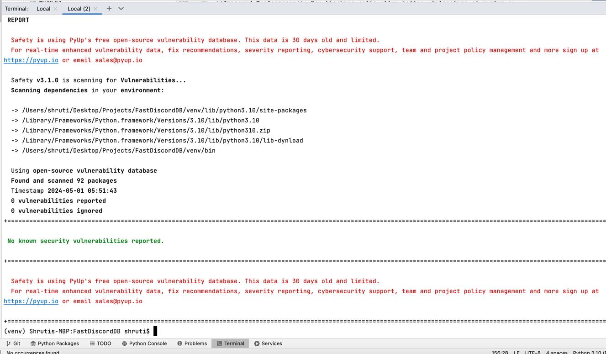

## API Performance Monitoring

To monitor the api, optimize resource utilization and address performance issues, I have added Pyinstrument profiler. Below is a sample screenshot of Export chat API.
The Export chat to postgre database took 4.58 seconds to upload some chat messages to Postgres.
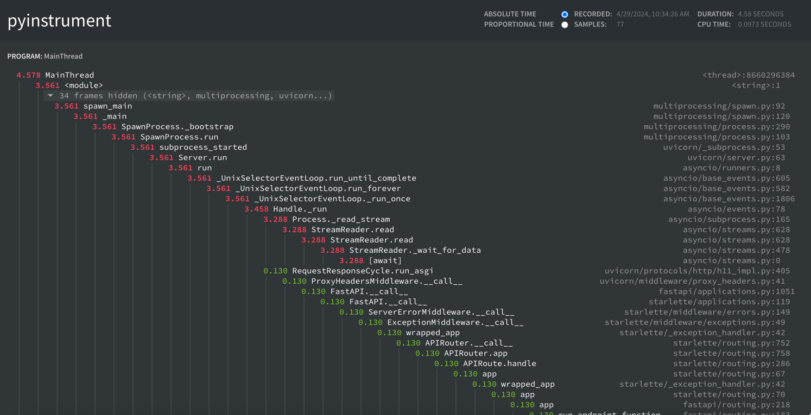
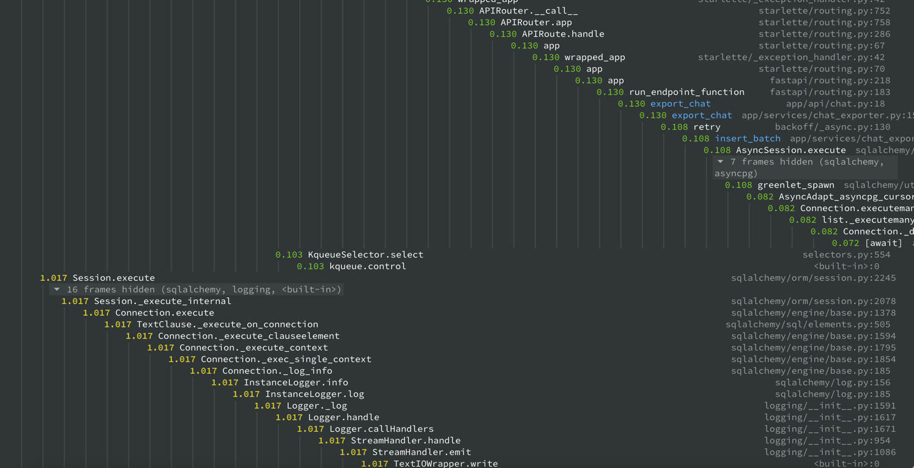


## Future Scope for FastDiscordDB Project

### 1. Multi-Region Deployment for Improved Latency and Redundancy
#### Description
Deploy the application in multiple regions to improve response times and provide redundancy in case of regional outages.
#### Implementation
Use cloud services like AWS, Azure, or Google Cloud Platform to deploy the application across multiple regions. Implement global load balancing and region-specific data replication strategies.

### 2. User Authentication and Authorization
#### Description
Introduce a secure user authentication and authorization system to control access to the API, allowing only authorized users to fetch or manipulate chat data.
#### Implementation
Integrate OAuth2 with JWT for secure API authentication and authorization. 
### 3. API Rate Limiting
#### Description
Implement API rate limiting to prevent abuse and ensure fair usage among consumers.
#### Implementation
Use middleware solutions like Redis-based rate limiting or third-party services such as Cloudflare to manage request rates per user.

### 4. Chat Data Lifecycle Management
#### Description
Develop policies and mechanisms for managing the lifecycle of chat data, including retention policies, data archiving, and purging outdated information.
#### Implementation
Create a configurable system that manages data retention based on predefined rules and schedules. Use database partitioning and archival strategies to optimize storage and performance.

### 5. Comprehensive Testing Framework
#### Description
Enhance the robustness of the application by developing a comprehensive testing framework covering unit tests, integration tests, and performance tests.
#### Implementation
Utilize pytest for Python to develop and automate tests. Incorporate CI/CD pipelines using tools like Jenkins or GitHub Actions to ensure code quality and stability with every update.

### 6. Customizable Export and Search Plugins
#### Description
Allow users to create and integrate custom plugins for data export and search capabilities, enabling customization for specific needs or integrations with other platforms.
#### Implementation
Develop a plugin architecture where external developers can create extensions or plugins that interact with the core system via well-defined APIs.

### 7. Synchronization Between Elasticsearch and PostgreSQL
#### Description
Ensure real-time synchronization between PostgreSQL and Elasticsearch to maintain data consistency across both platforms, enhancing the reliability of search operations and data analytics.
#### Implementation
Use synchronization tools like Logstash or custom change data capture (CDC) mechanisms to monitor changes in the PostgreSQL database and automatically update the corresponding documents in Elasticsearch. Logstash can be configured with input plugins for PostgreSQL and output plugins for Elasticsearch to facilitate this process.
#### Benefits
- **Data Consistency**: Guarantees that data stored in PostgreSQL is accurately reflected in Elasticsearch, ensuring that search results are always up-to-date.
- **Scalability**: Handles large volumes of data changes without significant performance degradation.
- **Flexibility**: Offers customization options through Logstash pipelines, allowing for tailored data processing and transformation to meet specific requirements.


## Conclusion
Expanding FastDiscordDB with these features would significantly enhance its utility, making it a more comprehensive solution for organizations and communities using Discord for communication. Each enhancement aims to add value by improving usability, performance, or security, aligning with the needs of modern, data-driven environments.
